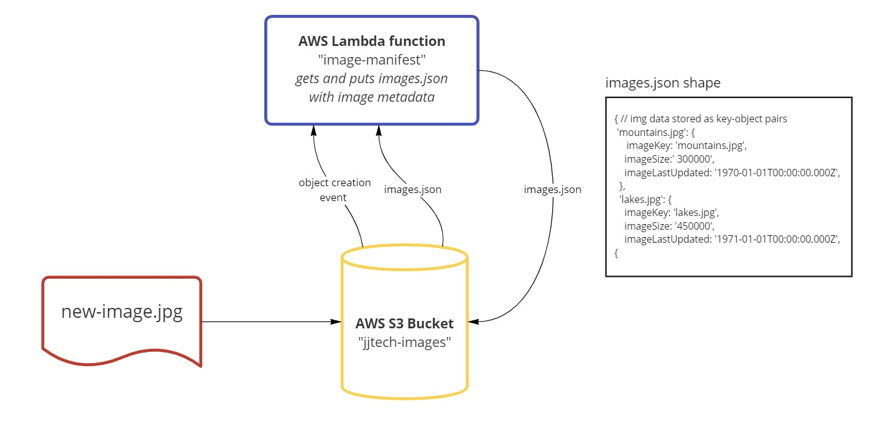

# S3 and Lambda

An AWS Lambda function for storing an image's metadata to S3. When an .jpg image is uploaded to a hooked-up S3 bucket, this Lambda function will add metadata about the image to a manifest file called `images.json`. If an image with the same filename as a previous/existing image is uploaded, the manifest data will be updated in place.

Since the image metadata was never meant to store duplicates and it had to be stored as JSON (serializable data only), I decided to forgo the instructions to use an object array and instead I used an object-containing-objects. This resulted in cleaner code which does not need conditional logic to add or update an entry, utilizing the spread operator and object literal behavior to that do so.

## UML Diagram



## Authors/Contributors

- Jeffrey Jenkins

## Credits/References

- I used these resources to learn how to put objects into to S3
  - [StackOverflow thread](https://stackoverflow.com/questions/40188287/aws-lambda-function-write-to-s3)
  - [Medium article](https://medium.com/swlh/upload-to-aws-s3-using-a-node-js-script-or-aws-lambda-e1877960bcea)

## Manifest Format

The `images.json` stores the image metadata in the following format (when processed with `JSON.parse()`):

```js
{
  'mountains.jpg': { // image record key, which is the same as the filename
    imageKey: 'mountains.jpg', // filename
    imageSize: '300000', // image size in bytes
    imageLastUpdated: '1970-01-01T00:00:00.000Z', // ISO 8601 timestamp
  },
  'lakes.jpg': { 
    imageKey: 'lakes.jpg',
    imageSize: '450000',
    imageLastUpdated: '1971-01-01T00:00:00.000Z',
  },
}
```
